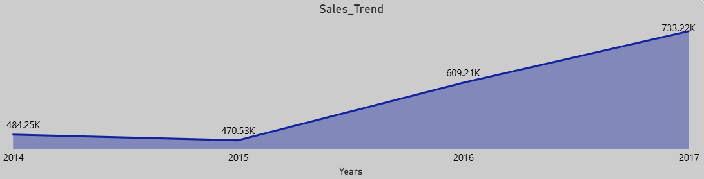
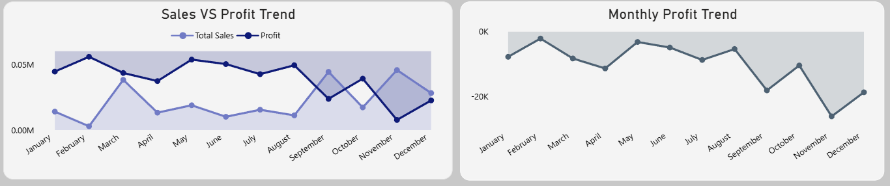

# Project Background
Super Store is retail business operating across multiple regions , offering a wide range of products including Technology, Office Supplies, and Furniture. The company records detailed transactional data related to sales, profits, discounts, customer segments, and regional performance from 2014 to 2017.

Despite consistent sales growth, the business faces challenges related to profitability, discount strategies, and uneven regional performance. Large volumes of transactional data existed, but had not been fully leveraged to derive actionable business insights.

This project analyzes and synthesizes Super Store’s historical data using Power BI to uncover key performance trends, identify profitability drivers and risks, and understand customer purchasing behavior. The analysis is designed to support data-driven decision-making and strategic optimization.

### Insights and recommendations are provided across the following key areas:

 •Sales Trends Analysis: Evaluation of historical sales patterns, order growth, seasonality, and average order value (AOV).

 •Profitability & Margin Analysis: Assessment of profit trends, margins, and category-level performance to measure business efficiency.

 •Discount Impact Analysis: Examination of how different discount levels affect profitability and identification of loss-making discount bands.

 •Regional Performance Analysis: Comparison of sales and profit across regions to identify high-performing and underperforming areas.

 •Customer Behavior Analysis: Analysis of customer retention, repeat purchase behavior, purchase frequency, and customer segmentation.

An interactive powerBI dashboard can be downloaded [here](Super_Store_report.pbix).

The Excel workbook used for data exploration and preparationcan be downloaded [here](Super_Store_Analysis.xlsx).

# Project Objectives
• Analyze overall sales and order growth over time.

• Evaluate profitability trends and margin performance.

• Assess the impact of discounting on profit.

• Identify high-performing and underperforming categories and regions.

• Understand customer loyalty, purchase frequency  and segmentation.

 # Executive Summary
   ### Overview of findings
   The business experienced consistent sales and order growth from 2014 to 2017, driven by          increasing customer demand.

   Customer analysis revealed extremely high repeat purchasing behavior, indicating strong          customer retention.

   Analysis revealed that discounts above 20% consistently reduced profit. with the highest 
   discount band generating losses , highlighting the importance of controlled discount             strategies.
   

### Sales Trend
   • Sales increased steadily from 2014 to 2017, indicating consistent demand growth.
   
   • Stronger sales momentum was observed during the second half of the year (Q3–Q4),                 reflecting seasonal demand patterns.
   
   • While sales increased consistently,profit growth remained dependent on discount levels,          emphasizing the inportance of controlled pricing strategies.
       .
### Profit Trend 
   • Profitability improved over time but showed higher volatility than sales.
   
   • High discount levels had a negative impact on profit, and in some cases led to loss, even when sales are high.
     .  
### Trend Analytics Insight   
   • Sales growth did not always translate into profit growth, highlighting the importance of margin and discount control.
### Customer Behavior 
   • The customer base exhibits extremely high repeat purchasing behavior , indicating strong customer retention.
   • Sales are primarily driven by high-frequency buyers, with the Consumer segment representing the largest share of customers.
### Key Takeaways
   • Growth is demand-driven,but profitability is sensitive to discounting .
   
   • Loyal, repeat customers are a critical driver of overall performance.
   
  # Strategic Recommendations :
   Based on the insights uncovered from sales, profitability, and customer behavior analysis, the following recommendations are proposed:

#### •Control excessive discounting to protect margins:
Analysis shows that discount levels above 20% consistently result in profit erosion and, in some cases, losses despite higher sales volumes. Implement stricter discount thresholds and approval controls to ensure revenue growth remains profitable.

#### •Prioritize high-margin product categories to drive sustainable profit:
Technology products contribute over 50% of total profit, making them the most reliable profit driver. Expanding assortments, targeted promotions, and cross-selling strategies within this category can significantly improve overall profitability.

#### •Improve underperforming regions through localized strategies:
While the West and East regions lead in profitability, the Central and South regions underperform. Applying region-specific pricing, targeted promotions, and optimized logistics can help close the profitability gap.

#### •Leverage strong customer retention and repeat purchasing behavior:
With nearly all customers being repeat buyers, the business should focus on retention-led growth strategies, such as personalized offers, reorder reminders, and loyalty-based incentives, rather than aggressive customer acquisition discounts.

#### •Capitalize on seasonal demand peaks to maximize returns:
Sales and profit trends indicate stronger performance during Q3–Q4. Aligning inventory planning, promotional campaigns, and staffing strategies with peak seasonal demand can maximize revenue while maintaining healthy margins.

## Conclusion:
   This analysis demonstrates how combining sales, profitability,and customer behavior insights enables more sustainable,data-driven business decisions.
  
